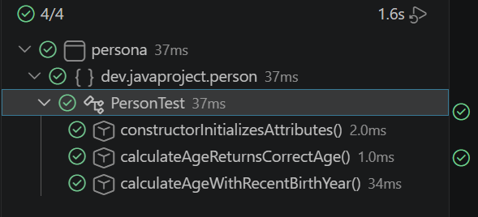
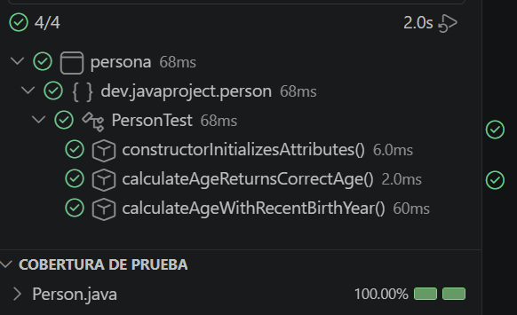
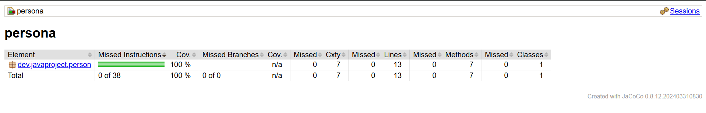
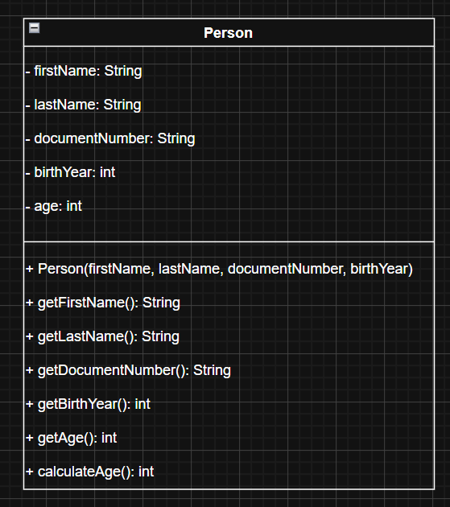

# Mi Primer Modelo Java

## 📝 Descripción

Proyecto Java desarrollado como parte de una kata de programación orientada a objetos. El objetivo es modelar la entidad **Persona** aplicando los conceptos fundamentales de Java: clases, atributos, constructores, métodos y encapsulación.

La clase `Person` representa a una persona con sus datos básicos de identificación y un método que calcula su edad dinámicamente en función del año de nacimiento y el año actual. Los atributos son privados y accesibles únicamente a través de getters, siguiendo el principio de encapsulación.

El proyecto está construido con **Maven** como gestor de dependencias y herramienta de construcción, e incluye una suite de tests unitarios con **JUnit 5** que garantizan el correcto funcionamiento de la clase, alcanzando una cobertura del 100% medida con **JaCoCo**.

## 💻 Tecnologías utilizadas

- Java 21
- Maven
- JUnit Jupiter 5.14.4
- JaCoCo 0.8.12

## 📁 Estructura del proyecto

```
├── assets/
├── src/
│   ├── main/
│   │   └── java/
│   │       └── dev/javaproject/person/
│   │           └── Person.java
│   └── test/
│       └── java/
│           └── dev/javaproject/person/
│               └── PersonTest.java
├── .gitignore
├── pom.xml
└── README.md
```

## 👤 Modelo

La clase `Person` representa a una persona con los siguientes atributos:

| Atributo | Tipo | Descripción |
|---|---|---|
| firstName | String | Nombre |
| lastName | String | Apellido |
| documentNumber | String | Número de documento de identidad |
| birthYear | int | Año de nacimiento |
| age | int | Edad calculada |

### Método principal

`calculateAge()` — calcula la edad de la persona en función del año actual y su año de nacimiento, y la almacena en el atributo `age`.

## ✅ Tests

El proyecto incluye tests unitarios con **JUnit 5** que cubren:

- Inicialización correcta de atributos mediante el constructor
- Cálculo de edad con distintos años de nacimiento

## 📷 Capturas

### Tests 





### Cobertura JaCoCo



### Diagrama de clases


